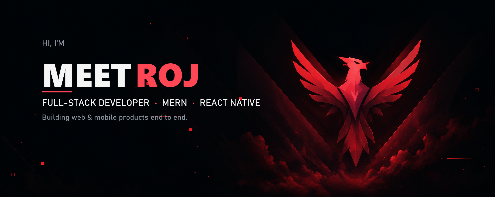

<table>
<tr>
<td width="25%" valign="top">

 &nbsp;**ABOUT ME**

UI/UX designer and full-stack developer. I design and build clean, modern digital experiences that solve real problems.

Always learning. Always shipping.

*Adapt. Build. Ship.*

</td>
<td width="25%" valign="top">

 &nbsp;**SELECTED PROJECTS**

**Creator Analytics**
 Influencer dashboard, admin panel, card builder.

**POV Camera**
 QR-based event photo sharing.

**UGC Marketplace**
 Brand ↔ creator deal flow.

**Homingo Worker**
 Field-worker app with live job assignment.

</td>
<td width="25%" valign="top">

 &nbsp;**TOOLS**

</td>
<td width="25%" valign="top">

 &nbsp;**CONNECT**

 

 

**Open to**
 Collaboration & freelance work.

</td>
</tr>
</table>

  <i>Adapt. Build. Ship.</i>

